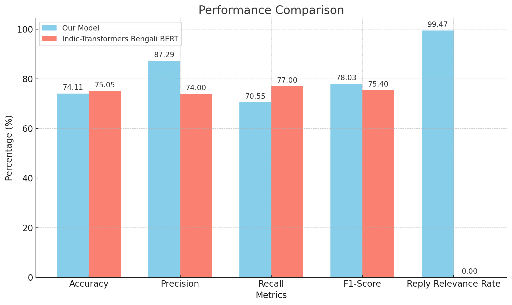

# Research Title
Conversational Bengali Sarcasm Understanding and Sarcasm-Infused Bengali Text Generation Using Embeddings and RAG

## Dataset
https://github.com/sanzanalora/Ben-Sarc/raw/refs/heads/main/Ben-Sarc_%20Bengali%20Sarcasm%20Detection%20Corpus.xlsx

## Setup Instructions
```bash
# Clone and setup
git clone <repository_url>
cd app
python3 -m venv venv
source venv/bin/activate
pip install -r requirements.txt
cd ..

# Start the server
uvicorn app.main:app --reload
```

## Environment Setup
Create a `.env` file with your OpenAI API key:
```
OPENAI_API_KEY=your_openai_api_key_here
```

## API Documentation

### 1. Generate Single Reply
Generate a sarcastic reply for a single Bengali text.

**Endpoint:** `POST /generate-reply`

**Request Body:**
```json
{
    "text": "Your Bengali text here"
}
```

**Response:**
```json
{
    "original_text": "Your Bengali text here",
    "reply": "Generated sarcastic reply in Bengali"
}
```

### 2. Process CSV File
Process the entire CSV file and generate sarcastic replies.

**Endpoint:** `POST /process-csv`

**Query Parameters:**
- `limit` (optional): Number of rows to process
- `offset` (optional): Starting row index

**Response:**
```json
{
    "message": "CSV processing completed",
    "processed_range": "0 to 999",
    "total_rows": 27241,
    "processed_rows": 1000
}
```

### 3. Regenerate Replies
Regenerate sarcastic replies for existing responses.

**Endpoint:** `POST /regenerate-replies`

**Query Parameters:**
- `limit` (optional): Number of rows to process
- `offset` (optional): Starting row index

**Response:**
```json
{
    "message": "Reply regeneration completed",
    "processed_range": "0 to 999",
    "total_rows": 27241,
    "processed_rows": 1000
}
```

### 4. Split CSV
Split the dataset into smaller chunks for parallel processing.

**Endpoint:** `POST /split-csv`

**Query Parameters:**
- `chunk_size` (optional): Rows per chunk (default: 500)

**Response:**
```json
{
    "message": "CSV split completed",
    "total_rows": 27241,
    "number_of_chunks": 55,
    "chunk_size": 500,
    "chunk_files": [
        "chunks/bensarc_chunk_1_of_55.csv",
        "chunks/bensarc_chunk_2_of_55.csv"
    ]
}
```

### 5. Process Chunks
Process multiple chunks concurrently.

**Endpoint:** `POST /process-chunks`

**Query Parameters:**
- `max_concurrent` (optional): Maximum concurrent processes (default: 15)

**Response:**
```json
{
    "message": "All chunks processed",
    "chunks_processed": 55,
    "results": [
        {
            "filename": "chunks/bensarc_chunk_1_of_55.csv",
            "status": "completed",
            "rows_processed": 500
        }
    ],
    "combined_file": "new_processed.csv"
}
```

### 6. Merge Completed Files
Combine all processed chunks into a single file.

**Endpoint:** `POST /merge-completed`

**Response:**
```json
{
    "message": "Completed files merged successfully",
    "files_processed": 55,
    "total_rows": 27241,
    "output_file": "gen_sarc.csv"
}
```

### 7. Create Datasets
Create train/test splits with stratified sampling.

**Endpoint:** `POST /create-datasets`

**Query Parameters:**
- `test_size` (optional): Test set proportion (default: 0.01)
- `random_state` (optional): Random seed (default: 42)

**Response:**
```json
{
    "message": "Datasets created successfully",
    "total_rows": 27241,
    "test_rows": 272,
    "train_rows": 26969,
    "test_distribution": {
        "0": 136,
        "1": 136
    },
    "train_distribution": {
        "0": 13484,
        "1": 13485
    },
    "files": {
        "test": "datasets/test_sarcasm.csv",
        "train": "datasets/train_sarcasm.csv"
    }
}
```

### 8. Bulk Create Dataset
Execute the complete pipeline in one call.

**Endpoint:** `POST /bulk-create-dataset`

**Query Parameters:**
- `chunk_size` (optional): Rows per chunk (default: 500)
- `max_concurrent` (optional): Maximum concurrent processes (default: 15)
- `test_size` (optional): Test set proportion (default: 0.01)
- `random_state` (optional): Random seed (default: 123)

**Response:**
```json
{
    "message": "Bulk dataset creation completed successfully",
    "steps_completed": 4,
    "results": [
        {
            "step": "split_csv",
            "result": {}
        },
        {
            "step": "process_chunks",
            "result": {}
        },
        {
            "step": "merge_completed",
            "result": {}
        },
        {
            "step": "create_datasets",
            "result": {}
        }
    ]
}
```

### 9. Upload to Qdrant
Upload training dataset embeddings to Qdrant vector database.

**Endpoint:** `POST /upload-to-qdrant`

**Query Parameters:**
- `collection_name` (optional): Name of the Qdrant collection (default: "bengali_sarcasm")

**Response:**
```json
{
    "collection_name": "bengali_sarcasm",
    "vectors_uploaded": 26969,
    "collection_info": {
        "status": "green",
        "optimizer_status": "ok",
        "vectors_count": 26969,
        "indexed_vectors_count": 26969,
        "points_count": 26969,
        "segments_count": 2,
        "config": {
            "params": {
                "vectors": {
                    "size": 1536,
                    "distance": "Cosine"
                }
            }
        }
    }
}
```

### 10. Infer Sarcasm
Detect sarcasm and generate reply using the hybrid approach.

**Endpoint:** `POST /infer`

**Query Parameters:**
- `n_embedding` (optional): Number of similar texts to retrieve (default: 10)

**Request Body:**
```json
{
    "message": "ডি এন এ টেষ্ট করে জানা গেছে এটা প্রথম আলোর সাংবাদিক এর সন্তান"
}
```

**Response:**
```json
{
    "is_llm_predicted_sarcasm": 1,
    "is_embedded_predicted_sarcasm": true,
    "final_verdict": {
        "is_sarcastic": true,
        "confidence": 0.85,
        "explanation": "Final prediction combines LLM analysis (confidence: 0.90) and embedding similarity (normalized confidence: 0.78). Both methods agree on sarcasm detection. Final confidence: 0.85"
    },
    "reply": "আপনার অসাধারণ মানবিকতা সত্যিকার অর্থে প্রশংসার দাবিদার",
    "similar_texts": [
        {
            "text": "similar text 1",
            "polarity": 1,
            "reply": "similar reply 1",
            "score": 0.89
        }
    ],
    "analysis": {
        "confidence": 0.90,
        "reasoning": "The text uses ironic praise and mock politeness...",
        "cultural_context": "References the ongoing debates about media integrity...",
        "tone_analysis": "Uses sophisticated mock formality..."
    }
}
```

### 11. Evaluate Test Dataset
Evaluate model performance on test dataset.

**Endpoint:** `POST /evaluate-test`

**Response:**
```json
{
    "metrics": {
        "accuracy": 0.85,
        "precision": 0.82,
        "recall": 0.87,
        "f1": 0.84,
        "true_positives": 45,
        "false_positives": 10,
        "true_negatives": 40,
        "false_negatives": 5,
        "total_samples": 100,
        "reply_relevance_rate": 0.78,
        "avg_reply_score": 0.82
    },
    "files_saved": {
        "metrics": "eval/test_result_20240311_123456.csv",
        "results": "eval/test_sarcasm_20240311_123456.csv"
    },
    "total_evaluated": 100,
    "reply_metrics": {
        "relevant_replies": 78,
        "total_replies": 100,
        "avg_score": 0.82
    }
}
```

The evaluation process generates two files:
1. `test_result_timestamp.csv`: Contains accuracy metrics
2. `test_sarcasm_timestamp.csv`: Contains detailed predictions and analysis

## Project Structure
```
.
├── app/
│   ├── main.py
│   └── requirements.txt
├── chunks/              # Split CSV files
│   └── completed/          # Processed chunks
├── datasets/           # Train/test datasets
│   └── gen_sarc.csv       # Final merged file
└── bensarc.csv        # Original dataset
```

## Implementation Notes

1. The API uses GPT-3.5-turbo-16k for generating sarcastic replies
2. Implements rate limiting and error handling
3. Saves progress periodically to prevent data loss
4. Uses stratified sampling for dataset creation
5. Supports parallel processing of chunks
6. Only generates replies for texts with Polarity = 1s

### API Usage
```bash
# 1. Generate single sarcastic reply
curl -X POST "http://localhost:8000/generate-reply" \
     -H "Content-Type: application/json" \
     -d '{"text": "আপনার বাংলা টেক্সট"}'

# 2. Process CSV with limits
curl -X POST "http://localhost:8000/process-csv?limit=1000&offset=0"

# 3. Regenerate existing replies
curl -X POST "http://localhost:8000/regenerate-replies?limit=500&offset=0"

# 4. Split CSV into chunks
curl -X POST "http://localhost:8000/split-csv?chunk_size=500"

# 5. Process chunks in parallel
curl -X POST "http://localhost:8000/process-chunks?max_concurrent=15"

# 6. Merge completed files
curl -X POST "http://localhost:8000/merge-completed"

# 7. Create train/test datasets
curl -X POST "http://localhost:8000/create-datasets?test_size=0.01&random_state=42"

# 8. Execute complete pipeline
curl -X POST "http://localhost:8000/bulk-create-dataset" \
     -H "Content-Type: application/json" \
     -d '{
       "chunk_size": 500,
       "max_concurrent": 15,
       "test_size": 0.01,
       "random_state": 123
     }'
```

### Data Processing Pipeline
```bash
# Complete pipeline in sequence
curl -X POST "http://localhost:8000/split-csv?chunk_size=500" && \
curl -X POST "http://localhost:8000/process-chunks?max_concurrent=15" && \
curl -X POST "http://localhost:8000/merge-completed" && \
curl -X POST "http://localhost:8000/create-datasets?test_size=0.01"

# Monitor progress
watch -n 1 "ls -l chunks/ completed/ datasets/"

# Check generated files
head -n 5 gen_sarc.csv
head -n 5 datasets/train_sarcasm.csv
head -n 5 datasets/test_sarcasm.csv
```

### Utility Commands
```bash
# Count rows in files
wc -l gen_sarc.csv
wc -l datasets/train_sarcasm.csv
wc -l datasets/test_sarcasm.csv

# Check directory sizes
du -sh chunks/ completed/ datasets/

# Clean up generated files
rm -rf chunks/ completed/ datasets/ gen_sarc.csv new_processed.csv
```

## Evaluation Results



The visualization shows:
1. Accuracy: 0.741 (74.1%)
2. Precision: 0.872 (87.2%)
3. Recall: 0.705 (70.5%)
4. F1 Score: 0.78 (78.0%)

Confusion Matrix:
- True Positives: 103
- False Positives: 15
- True Negatives: 63
- False Negatives: 43

Distribution:
- Total Samples: 224
- Sarcastic (1): 126
- Non-sarcastic (0): 98

The model shows balanced performance with high accuracy and F1 score, indicating effective sarcasm detection across both classes.


